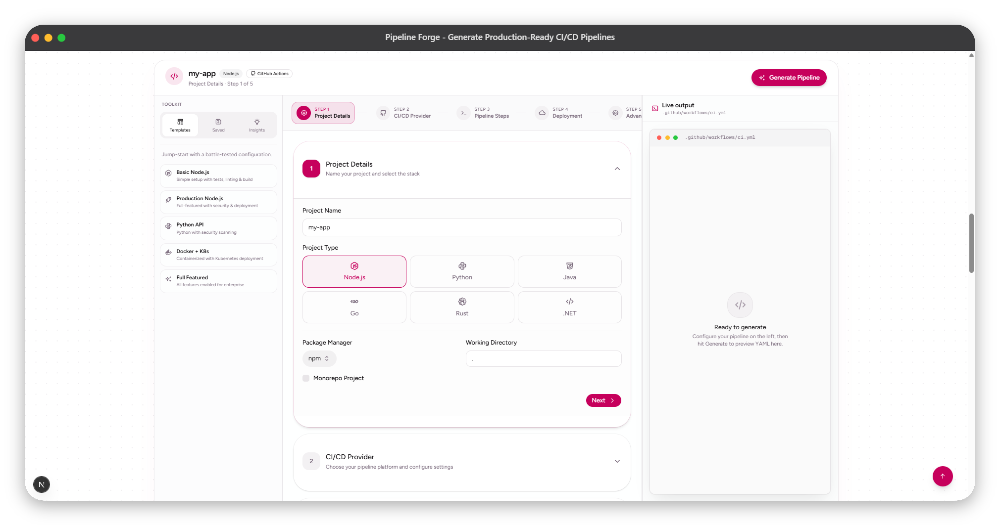

<p align="center">
  
</p>

<p align="center">
  <strong>Generate production-ready CI/CD pipelines in seconds — no YAML archaeology required.</strong>
</p>

<p align="center">
  <a href="LICENSE"></a>
  <a href="https://nextjs.org"></a>
  <a href="https://www.typescriptlang.org"></a>
</p>

---

## What is Pipeline Forge?

**Pipeline Forge** is a free, open-source **Pipeline Studio** that runs in your browser. You configure projects through a guided UI — project type, CI provider, tests, security, Docker, deployment — and get **copy-ready YAML** for GitHub Actions, GitLab CI, Jenkins, CircleCI, or Azure Pipelines.

No accounts. No backend. Your configuration stays in the browser until you export it.

---

## The problem it solves

Setting up CI/CD usually means:

- Hunting through docs for every provider’s YAML shape
- Rebuilding the same lint → test → build → deploy flow for every repo
- Guessing at caching, matrix builds, secrets, and deployment steps
- Shipping broken or outdated pipeline config under time pressure

**Pipeline Forge turns that into a 5-step workflow** with presets, live YAML preview, validation, and best-practice hints — so you start from something correct and adapt it, instead of from a blank file.

---

## How it helps

| You need to… | Pipeline Forge gives you… |
|--------------|---------------------------|
| Bootstrap a new repo | Quick presets (Basic Node, Production, Python API, Docker + K8s, Full Featured) |
| Support npm, yarn, or pnpm | Package-manager-aware install, cache, and script commands |
| Test on Node 18 & 20 | Matrix build configuration across versions |
| Add env vars & artifacts | Advanced options wired into generated YAML |
| Pick a deploy target | Steps for AWS ECS, Kubernetes, Vercel, Netlify, Fly.io, Railway, GCP, Azure, and more |
| Avoid silly YAML mistakes | **Live validation** on generate (syntax + provider checks) |
| Reuse a setup later | Save/load configs locally, export/import JSON, undo/redo |
| Estimate CI cost | Rough monthly cost estimate from your selected steps |

---

## Features

### Pipeline Studio
- **5-step wizard** — Project → CI provider → Pipeline steps → Deployment → Advanced
- **Toolkit sidebar** — Templates, saved configs, insights (best practices + cost)
- **Live output panel** — Syntax-highlighted YAML with copy & download
- **Light/dark terminal** — Theme-aware preview

### Generation engine
- **5 CI providers** — GitHub Actions, GitLab CI, Jenkins, CircleCI, Azure Pipelines
- **6 runtimes** — Node.js, Python, Java, Go, Rust, .NET
- **Package managers** — npm, Yarn, pnpm, Bun, pip, Poetry, Maven, Gradle
- **Monorepos** — Nx, Turborepo, Lerna, Rush
- **Pipeline steps** — Lint, format, typecheck, unit tests, E2E, build, cache, security scan, dependency audit, Docker build, container scan, SonarQube
- **Deployments** — AWS, Kubernetes, Vercel, Netlify, Heroku, Azure, GCP, Fly.io, Railway, Cloudflare Pages, DigitalOcean
- **Advanced** — Env vars, custom scripts, matrix builds, artifacts, schedules, multi-environment deploys, deployment strategies (rolling, blue-green, canary), conditional steps, custom actions, optimization flags
- **YAML validation** — Config + output checks when you hit **Generate**

### Developer experience
- Configuration **save/load** (localStorage)
- **Export/import** JSON
- **Undo/redo** history
- **Best practices** suggestions
- **Cost estimation** for your pipeline shape
- Fully **responsive** UI

---

## Quick start

```bash
git clone https://github.com/NotHarshhaa/pipeline-forge.git
cd pipeline-forge
npm install
npm run dev
```

Open [http://localhost:3000](http://localhost:3000) → scroll to **Pipeline Studio** → configure → **Generate Pipeline**.

Verify the generator locally:

```bash
npm run verify:pipeline
```

---

## How it works

1. Choose a **preset** or start from defaults  
2. Set **project details** (name, stack, package manager, monorepo, working directory)  
3. Pick a **CI/CD provider**  
4. Toggle **pipeline steps** (test, lint, security, Docker, …)  
5. Optionally set **deployment** and **advanced** options  
6. Click **Generate** — review YAML, validation banner, then copy or download  

Documentation walkthrough: `/instructions` on the live site.

---

## Example output

GitHub Actions (Node.js, pnpm, matrix, env, artifacts):

```yaml
name: my-app CI/CD Pipeline

on:
  push:
    branches: ["main", "develop"]
  pull_request:
    branches: ["main", "develop"]

concurrency:
  group: ${{ github.workflow }}-${{ github.ref }}
  cancel-in-progress: true

jobs:
  build:
    runs-on: ubuntu-latest
    strategy:
      matrix:
        node-version: ["18", "20"]
    env:
      NODE_ENV: 'test'
    steps:
      - uses: actions/checkout@v4
      - uses: pnpm/action-setup@v4
      - run: pnpm install --frozen-lockfile
      - run: pnpm test
      - uses: actions/upload-artifact@v4
        with:
          name: my-app-artifacts
          path: dist
```

---

## Tech stack

- **Next.js 16** · **React 19** · **TypeScript** · **Tailwind CSS v4** · **shadcn/ui**
- Template engine in `src/lib/templates/` — one generator per CI provider

---

## Roadmap

**Shipped:** GitLab CI, Jenkins, CircleCI, Azure Pipelines, presets, save/load, export/import, undo/redo, syntax highlighting, best-practices analyzer, cost estimation, YAML validation  

**Planned:** Travis CI, Bitbucket Pipelines, advanced K8s templates, pipeline graph view, AI-assisted optimization  

See the in-app roadmap on the homepage for the full list.

---

## Contributing

Contributions are welcome.

1. Fork the repo  
2. Create a branch (`git checkout -b feature/your-feature`)  
3. Commit and push  
4. Open a Pull Request  

---

## License

[MIT](LICENSE)

---

## Links

- **Repository:** [github.com/NotHarshhaa/pipeline-forge](https://github.com/NotHarshhaa/pipeline-forge)  
- **Issues:** [Report a bug or request a feature](https://github.com/NotHarshhaa/pipeline-forge/issues)  

---

<p align="center">
  If Pipeline Forge saves you time, consider starring the repo and sharing it with your team.
</p>

<p align="center">
  <strong>Made with care by developers, for developers.</strong>
</p>
